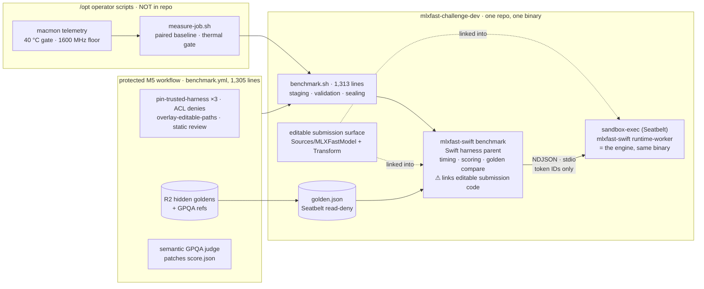
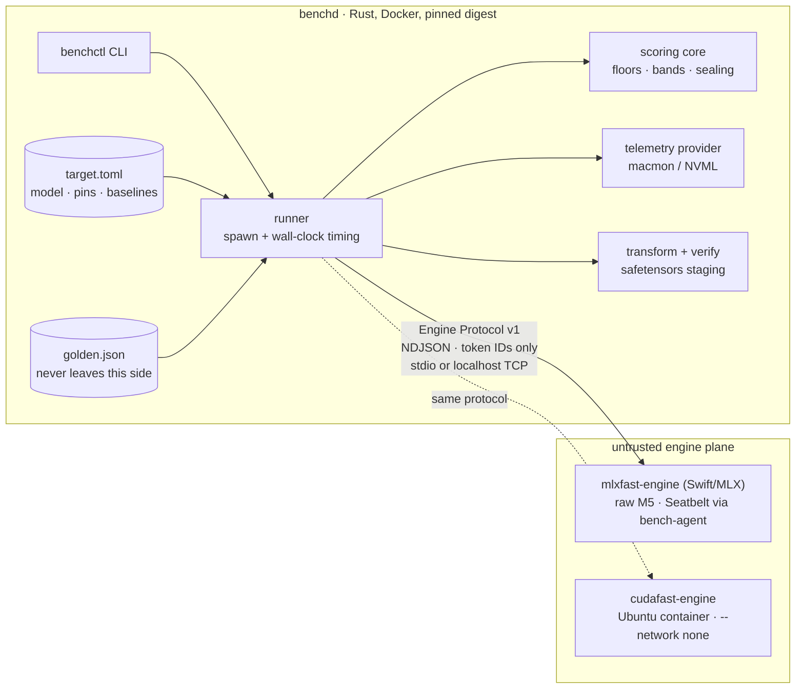

# Splitting the benchmarker from the inference engine

**Architecture proposal — mlxfast-challenge-dev**

A Rust, reproducible, sandboxed benchmarker in Docker; interchangeable inference
engines behind a frozen wire protocol — Swift/MLX raw on M5s today, CUDA in Ubuntu
containers next.

---

## 0. The one-paragraph version

The split already exists inside the repo — it just isn't packaged as one. For
anti-cheat reasons, all model execution happens in a child process
(`mlxfast-swift runtime-worker`) speaking **newline-delimited JSON over stdio**,
exchanging *only token IDs, top-K logits, and RSS*; all timing is parent-side wall
clock, and worker-reported numbers are explicitly distrusted. That protocol is the
seam. The plan: freeze it as **Engine Protocol v1**, rebuild the trusted side
(orchestration + timing + scoring + sealing, currently spread across
`benchmark.sh`, the Swift harness targets, and duplicated jq) as a single Rust
workspace shipped as a pinned Docker image, and let engines be dumb protocol
servers: the existing Swift/MLX engine running raw on M5s, and a new CUDA engine in
an Ubuntu container. Container isolation replaces macOS Seatbelt on Linux; a thin
host agent keeps Seatbelt on the Macs.

> **Why this works:** because the harness only ever sends token IDs and measures
> round-trip wall time, the engine's language, framework, and GPU are invisible to
> the benchmarker. Nothing in the scoring path needs to know Metal from CUDA.

---

## 1. What's coupled today

Three findings from the code map drive the design:

- **Trusted timing lives inside the Swift binary**, not the shell.
  `QwenRuntimeBenchmark.swift` clocks the worker's request/response round trips
  (`DispatchTime` uptime); `benchmark.sh` only orchestrates, validates, and seals.
  So "extract the benchmarker" means extracting the Swift harness targets *plus*
  the 1,300-line shell script, not just the script.
- **Scoring constants are triplicated**: `MLXFastConstants` (Swift),
  `benchmark.yml` env, and jq literals in `overlay-paired-timing.sh` all encode the
  same floors and the `decode^0.75 · prefill^0.25` formula. Any drift is a scoring
  bug.
- **Every isolation mechanism is macOS-only**: Seatbelt profiles (generated in both
  shell and Swift), `sandbox-exec`, APFS clonefile, macOS ACLs, macmon thermal
  telemetry, mach RSS. None of it ports; all of it maps cleanly to container
  primitives.

Also load-bearing: the harness tokenizes *outside* the engine (swift-transformers
against the weights dir), the worker env is sanitized to an allowlist so submitted
code can't see mode or golden paths, and the on-disk score written by the
(untrusted-linked) benchmark process is discarded and re-materialized from sealed
stdout. All three properties get *simpler* in the new shape.

### Current architecture

Everything below lives in **one repo and one binary**: the submission's editable
modules link into both the harness parent (which writes the score) and the worker
child. The trust boundary is defended procedurally — pins, ACLs, overlays,
resealing — rather than structurally.



Two structural weaknesses stand out against the target: the score-writing process
links code the contestant wrote (hence the discard-and-reseal-from-stdout dance),
and the trusted harness ships inside the repo contestants fork (hence the
pin/ACL/overlay machinery). The paired-baseline "engine" is an entire second
checkout of this same repo, pinned at the on-box baseline checkout.

---

## 2. Target architecture



### Deliverable 1 · Rust workspace — `mlxfast-bench` (the trusted benchmarker)

One repo, one Rust workspace, one Docker image (plus static binaries for bare-metal
use). Absorbs and retires: `benchmark.sh`, the Swift harness targets
(`QwenRuntimeBenchmark`/`LocalIterate`/`Preflight`/`Correctness`),
`verify-transform`, and the jq scoring duplicates.

- `bench-protocol` — wire types + JSON Schema for Engine Protocol v1; the single
  normative definition.
- `bench-core` — golden schema, score formula, speedup floors, acceptance bands,
  sealing. *The one home* for today's triplicated constants; property tests ported
  from the Swift test suite.
- `bench-runner` — engine lifecycle (spawn / connect), parent-side `Instant`
  timing, phase sequencing, allocator-drain and anti-memoization enforcement,
  offline probe.
- `bench-transform` — port of the MLX-free Swift transform + the staged-output
  validation currently in `benchmark.sh` (gap-free safetensors tiling, atomic
  publish). One implementation serves both platforms; it must run on Linux anyway
  for CUDA provisioning.
- `bench-telemetry` — a provider trait: `macmon` on M5 (temp gate, GPU clock floor,
  util samples), `NVML` on CUDA boxes. Thermal gates and clock-floor rejection
  become config, not hardcoded Apple numbers.
- `benchctl` — the CLI: `setup`, `transform`, `iterate`, `submit`, `official`.

**Reproducible + secure by construction:** `cargo build --locked` with a pinned
toolchain, static binary in a distroless image, image published by digest and
signed. The golden lives only in the benchd mount namespace — the engine can't read
what isn't in its filesystem, which is strictly stronger than today's "deny
file-read on the golden path" Seatbelt rule. Benchd is the *only* writer of score
artifacts, which structurally eliminates the discard-and-reseal dance.

Tokenization moves to the Rust `tokenizers` crate (goldens are already
pre-tokenized, so runtime exposure is nil; golden-authoring paths need a one-time
parity test against swift-transformers).

### Deliverable 2 · Swift package — `mlxfast-engine` (the Metal engine, extracted)

Extract from the current repo: `MLXFastModel/**`, the *server half* of
`QwenRuntimeWorker.swift` (loop + request handler + pinned-config validation),
`QwenCorrectness.swift`, and the portable core (safetensors, tensor store). Ships as
a pinned release: one binary + `mlx.metallib`. Runs raw on M5s — Metal can't live
in a container on macOS, and that's fine: the engine is the untrusted side anyway.

Prerequisites already known: push + pin the `mlx-swift-lm` fork (currently a
local-path override in `Package.swift` — the hard blocker), and split
`Constants.swift` into engine-shape vs scoring constants.

### Deliverable 3 · Ubuntu container — `cudafast-engine` (the migration target)

A new protocol server in a CUDA base image. Because the protocol is eight message
kinds over stdio, the *reference* engine's stack is unconstrained — candle/Rust,
C++, or a Python runtime are all legal; recommend starting with whatever reaches
Qwen3.6 parity fastest and treating the container as the unit of pinning. Runs with
`--network none`, read-only rootfs, weights as a read-only mount, `cap-drop ALL`,
non-root, pids/memory limits, default seccomp.

**Ranking vs bring-up (see §8, cycle 3):** a *submission* does not replace the whole
engine — it edits a fixed, declared surface (the CUDA analogue of `editablePaths`)
inside a pinned harness that owns the protocol loop, phase barriers, and allocator
drain, mirroring the Swift engine's existing split between the harness-owned server
loop and the editable model modules. The container pins the runtime; the editable
paths are the static-review target.

### Deliverable 4 · trusted timing peer — `bench-agent` (for raw M5 engines)

Docker on macOS is a Linux VM, so a containerized benchd can't spawn a host process
— and, per §8 cycle 1, it must not *time* one either, since a VM clock across the
VM↔host boundary is less accurate than a native one. `bench-agent` is a small static
Rust binary (same workspace) that runs natively on the Mac: it wraps the engine in a
generated Seatbelt profile, sanitizes the env, spawns it, and **owns the
parent-side wall clock** for the protocol round trips, exposing sealed timing
samples to the containerized benchd, which orchestrates and scores. It bridges the
engine over a `127.0.0.1` listener guarded by a single-use, session-bound token
(§4). Because it holds the most attackable number in the system, bench-agent is
**ring-0 trusted**: release-hash pinned and verified by benchd before each run — a
trusted timing peer, not a passive shim. On Linux none of this applies: the engine
is a peer container on an internal compose network and benchd times it natively.

---

## 3. Engine Protocol v1

Freeze what exists; add only a version handshake. Transport: NDJSON over stdio
(default, co-located) or localhost TCP (cross-boundary via bench-agent / compose
network). Request `{id, kind, ...}` → response `{id, nonce, ok, ...}`.

| kind | in | out | notes |
|------|----|----|-------|
| `hello` | — | nonce, **protocol_version**, **backend**, **device**, expert_stats | emitted after in-engine weight/config validation; new fields in bold |
| `prefill` | prompt_tokens[] | token | must force full evaluation before responding |
| `decode_begin` | seed_tokens[] | seed_token | exactly one seed forward; no warmup permitted |
| `decode_step` | token | token | single step; must share the code path with correctness_step |
| `correctness` | prompt_tokens[], steps | tokens[], peak_ram_gb | free-run greedy |
| `correctness_begin` / `_step` | prompt_tokens[] / token | token, top_logits[8] | teacher-forced; feeds anchor-gate rank/delta tolerance |
| `phase_diagnostics` | — | expert_stats, peak_ram_gb | followed by allocator drain |

**Invariants (normative, engine-agnostic):** all timing is benchmarker-side wall
clock over round trips; only token IDs cross the boundary (harness owns
tokenization); session discarded on any error; allocator drained to zero at the
start of **every new correctness / prefill / decode sequence** (PROTOCOL.md is
normative here), fail-closed — MLX's `Memory.clearCache()`/`cacheMemory == 0` on Metal, a
`cudaDeviceSynchronize` + pool-trim + verified-zero analogue on CUDA; no cross-phase
memoization and no repeated identical forwards inside a timed window; decode clock
starts *before* `decode_begin` so speculative setup is charged.

**Phase-close barrier (§8, cycle 2):** because "force full evaluation" is
engine-internal and unobservable, the returned token must be a *materialized* ID
(you cannot serialize an argmax you haven't computed — that is itself the sync), and
every timed phase ends with a `phase_diagnostics` barrier plus a monotonic
completed-work counter the engine must report equal to the issued step count; a
mismatch fails the run. No timing trust is placed in the engine — the barrier only
makes deferred/async work observable.

### Consistency across MLX-Swift and CUDA — three layers

The wire protocol alone does not make two GPU stacks equivalent. Consistency is
enforced at three layers, and the third — not the wire format — is what actually
defines "consistent."

1. **Syntactic (the wire).** Both engines are NDJSON servers implementing the eight
   kinds from the one `bench-protocol` schema. A protocol conformance test drives
   any engine binary — handshake, message ordering, nonce echo, error →
   session-discard. Identical by construction.
2. **Structural (the narrow seam).** The entire trusted→engine surface is five
   entry points, mapped below. Both backends implement the same signatures; the
   non-negotiable is that `decode_step` and `correctness_step` route through the
   *same* `forward`, so an engine can't tell it's being timed.
3. **Semantic (golden conformance) — the real definition.** Metal and CUDA cannot
   produce bit-identical logits (different reduction orders, fused ops, rounding).
   So "consistent" is not identical math — it is *passing the same golden within
   acceptance bands*. The golden schema already carries those tolerances (built for
   Metal-build variance): anchor cases pass if argmax ∈ `accepted_tokens`, *or*
   expected-token `rank ≤ max_expected_rank` and top-logit delta ≤
   `max_top_logit_delta`; free-run matches `exact_prefix_tokens` then greedy. **The
   golden is the conformance suite;** a CUDA engine becomes rankable the moment it
   passes anchor/free-run gates at the target's tolerances, never before.

| abstract seam | MLX-Swift today | CUDA analogue |
|---|---|---|
| `load(weights_dir) → Model` | `Qwen35RuntimeWeightCache` — validates config + 1847-tensor inventory, fails before `hello` | same validation, fail-before-hello |
| `Session::new` (48 recurrent + 16 KV) | `MambaCache ×48` + `KVCacheSimple ×16` | same cache topology + position-offset rules |
| `forward(session, tokens[], pos_offset) → Logits` | `Qwen35Model.logits(inputIDs:cache:positionOffset:)` — the one hot path | cuDNN / cutlass / custom kernels behind the same signature |
| `argmax` / `top_k(8)` | `QwenCorrectness.greedyToken` / `topLogits` | same; shared canonical tie-break |
| tensor/quant materialization | `MLXTensorBridge`: `MaterializedTensor → MLXArray` | `MaterializedTensor → device tensor` (the single dtype choke point) |

**Shared contract both reimplement to spec** (where CUDA parity work lives):
identical transform output (flattened `config.json`, safetensors index, tokenizer);
the architecture recipe — 4-bit affine group-64, partial RoPE θ=1e7, 64 layers as
`[GatedDeltaNet ×3, attention]×16`, untied quantized LM head; and cache-advancement
semantics that must match or the teacher-forced gates diverge. One tightening:
define a **canonical argmax tie-break (lowest token id)** both implement, shrinking
the tolerance surface rather than leaning only on accepted-token sets.

> **Engine conformance kit** (in `bench-core`): point it at any engine
> binary/endpoint + a public golden, and it runs protocol conformance +
> anchor/free-run gates + a checked-in reference-logits fixture with tolerances.
> Green on both MLX-Swift and CUDA = consistent. It is simultaneously the CUDA
> bring-up gate and the Swift engine's regression gate. The `hello` message reports
> `backend` + `device`, so every score records which stack produced it and
> cross-backend numbers are labelled not-comparable (ties to §9's
> per-platform-baseline rule).

---

## 4. Security model: Seatbelt → containers

Two layers must both port: the *sandbox mechanisms* (first table) and the
*privilege rings* — today's multi-user design where the CI runner user (ring 0)
holds secrets and seals scores, a `sudo -n` bridge to the on-box exec script hands off to an
ephemeral `bench` uid (ring 2, per-uid PF egress block, workspace write
confinement, process cap), the runtime worker runs under Seatbelt (ring 3), and
`janitor.sh` wipes and audits after every run.

### Sandbox mechanisms

| today (macOS) | new Linux path | new M5 path |
|---|---|---|
| Seatbelt `deny network*` + curl self-test | engine container `--network none`; benchd probes egress before each run | bench-agent keeps the generated Seatbelt profile |
| `deny process-fork/exec*` | default seccomp, `pids-limit`, `no-new-privileges` | unchanged (Seatbelt) |
| write-deny + `MLXFAST_OFFLINE_WRITABLE_PATHS` allowlist | read-only rootfs, ro weights mount, tmpfs scratch | unchanged |
| `deny file-read` on golden + private dir | **stronger:** golden is never in the engine's mount namespace at all | same — golden stays inside benchd's container |
| env sanitization allowlist in Swift | containers start with an explicit env; benchd passes nothing | bench-agent applies the allowlist |
| `pin-trusted-harness.sh` (3× TOCTOU checks) | image digest pinning + signatures for benchd and the CUDA engine; release-hash pin for the M5 engine binary + metallib, verified by benchd at spawn | ← same |
| score discarded from disk, re-sealed from stdout | structurally gone: only benchd writes scores; engines never see score paths | ← same |
| macmon thermal gate, 1600 MHz clock floor | NVML provider: temp gate, SM-clock floor, util sampling — values from `target.toml` | macmon provider, same trait |

### Privilege rings, mapped

| ring (today, M5) | new M5 path | new Ubuntu/CUDA path |
|---|---|---|
| **Ring 0** — CI runner user: secrets, golden pulls, score sealing, artifact validation | Runner user unchanged: runs the benchd container, holds secrets, owns score outputs. Secrets reach benchd only in `official` mode via a runner-owned mounted file (0600) — never the engine side. | Dedicated unprivileged `bench-runner` host user — *not* in the `docker` group. Runs benchd via **rootless podman**. Same secrets rule. |
| **Ring 1→2 bridge** — `sudo -n bench-exec.sh` drops to ephemeral `bench` uid; per-uid PF egress block; workspace confinement; process cap | **Kept.** bench-agent spawns the engine through the same sudo bridge to the `bench` uid; PF egress + confinement unchanged. | Second host user `bench-engine` with a subordinate uid/gid range (**userns remap**). A container escape lands in an unprivileged uid that owns nothing but per-run scratch. Egress: `--network none` + nftables per-uid block. |
| **Build of submitted code** — runs as `bench` via bench-exec | Unchanged. | Throwaway build container under `bench-engine`'s range, no network (vendored/locked deps), fresh cache per run; only the built artifact is handed forward. |
| **Ring 3** — Seatbelt around `runtime-worker` | Kept: bench-agent generates the profile. | The engine container: read-only rootfs, `cap-drop ALL`, `no-new-privileges`, default seccomp, pids/memory limits. |
| **Post-run** — `janitor.sh` wipe + signed audit; `quarantine.flag` | Unchanged. | Per-run ephemeral containers + volumes destroyed by a `bench-runner`-owned janitor unit; quarantine = host flag checked by ring-0 preflight. |

**Three rules that keep the rings honest:**

- **benchd never touches a container-control socket.** A container holding the
  Docker/podman socket is root on the host. Engine lifecycle belongs to host-side
  units owned by `bench-runner`/`bench-engine` (compose services, systemd/quadlet,
  or bench-agent); benchd only ever *connects* to an engine, it never launches
  containers.
- **The TCP bridge is authenticated (§8, cycle 5).** bench-agent binds `127.0.0.1`
  only and requires a *single-use, session-bound* token minted by ring 0, carried
  in the `hello` and bound to the session nonce. Exactly one authenticated session
  per run; a second connection or a nonce mismatch is rejected and discards the
  session — defeating co-tenant injection and token replay on these multi-user
  boxes.
- **Ownership follows the rings.** Weights: written by ring 0's transform, mounted
  read-only to the engine uid. Goldens and scores: ring 0 only, never in any
  engine-side namespace. Telemetry binaries (macmon/NVML readers): ring-0-owned and
  pinned, since a gamed thermal gate is a scoring attack.

---

## 5. Configuration: one bundle per target

Everything currently scattered across `MLXFastConstants`, `benchmark.yml` env,
fixtures, and R2 key names becomes one signed `target.toml` per (model, platform):

```toml
# qwen36-27b.m5.toml — sketch
[model]      id = "mlx-community/Qwen3.6-27B-4bit"  revision = "c000ac2c…"
             tensors = 1847  manifest = "sha256/reference_qwen3_6_27b_4bit.sha256"
[engine]     kind = "tcp"  addr = "host.docker.internal:7331"   # or kind = "spawn"
             pin = { binary = "sha256:…", metallib = "sha256:…" }
[baselines]  prefill_spt = …  decode_spt = …        # per-platform, recalibrated
[scoring]    decode_weight = 0.75  prefill_weight = 0.25  floor = 0.95
             bands = { prefill = "±5%", decode = "+2%/-5%" }
[gates]      semantic_min_pass = 1  gpqa_cases = 5  max_new_tokens = 64
[telemetry]  provider = "macmon"  cool_gate_c = 40  clock_floor_mhz = 1600
```

The CUDA target is the same schema with `provider = "nvml"` and its own recalibrated
baselines. This also cleanly resolves the current Gemma/Qwen tangle: model identity,
baselines, golden identity, and R2 keys travel together or not at all.

---

## 6. Deployment topologies

### M5 (today's hardware)

```
bench-agent   native, ring-0 pinned (static bin, launchd)
(on box):     ├─ sandbox-exec → mlxfast-engine runtime-worker --weights …
              ├─ OWNS the wall clock: times protocol round trips natively
              └─ 127.0.0.1:7331, single-use session-bound token

benchd:       docker run --pull=never ghcr.io/…/benchd@sha256:…  \
                benchctl iterate --target qwen36-27b.m5.toml
              orchestrates + scores; consumes bench-agent's sealed timings
              (never times through the VM — §8 cycle 1)
```

Minimal setup goal: `curl -fsSL …/install-m5.sh | sh` installs bench-agent + pinned
engine release + verifies the weights manifest; after that every run is one
`benchctl` command. (Dev shortcut: benchd also ships as a native macOS binary that
spawns the engine directly over stdio — no Docker, no agent — for tight iteration.)

### Ubuntu / CUDA (migration target)

```yaml
# docker-compose.yml — sketch
services:
  engine:
    image: ghcr.io/…/cudafast-engine@sha256:…
    networks: [benchnet]          # internal: true — no egress
    gpus: all
    read_only: true
    volumes: [ "weights:/weights:ro" ]
    cap_drop: [ALL]
  benchd:
    image: ghcr.io/…/benchd@sha256:…
    networks: [benchnet]
    volumes: [ "goldens:/goldens:ro", "results:/results" ]
networks:
  benchnet: { internal: true }
```

One `docker compose up` after `benchctl transform` populates the weights volume.
Baselines for scoring come from the CUDA target file, measured on the reference
implementation on the same hardware class.

---

## 7. Migration plan

1. **Phase 0 — freeze the seam** (in the current repo, small diffs): add
   `protocol_version`/`backend`/`device` to the hello message; write `PROTOCOL.md`
   + JSON Schema; split `QwenRuntimeWorker.swift` into client and server targets;
   split `Constants.swift` engine-shape vs scoring; push and pin the `mlx-swift-lm`
   fork.
2. **Phase 1 — extract the engine**: new `mlxfast-engine` Swift package (model +
   worker server + transform-free core), pinned releases (binary + metallib),
   current repo consumes it unchanged so nothing breaks mid-flight.
3. **Phase 2 — build benchd to parity**: Rust workspace drives the Swift engine on
   an M5; acceptance = score fields match `./benchmark.sh --local-iterate` and
   `--local-submit` on identical weights + goldens, plus ported scoring unit tests.
   Both harnesses coexist during this phase.
4. **Phase 3 — CUDA engine bring-up**: container passes the correctness + anchor
   gates first (argmax tie-break tolerance across Metal/CUDA already exists in the
   compare logic — reuse it), then baseline recalibration on reference hardware,
   then timed runs.
5. **Phase 4 — cut over**: official pipeline invokes `benchctl official`; retire
   `benchmark.sh`, the Swift harness targets, and the jq scoring copies. The
   paired-run/thermal contract of `measure-job.sh` is reimplemented inside benchd
   (baseline-first paired runs, telemetry acceptance, one gated retry, calibration
   band).

---

## 8. Red / green teaming

Six adversarial passes. Each is an attack (**red**) a cheating submission or a
co-tenant could attempt, the fix that folds back into the design (**green**), and —
where the fix invites a follow-on — the counter-attack (**red↩**). Findings 1–4
changed the architecture; 5–6 confirmed it holds.

### Cycle 1 — Timing moved into a VM-hosted container on the M5

- **red:** §2 had benchd (containerized) doing the timing on M5. But Docker on
  macOS is a LinuxKit VM — its clock and VM↔host scheduling add jitter and can step
  relative to host wall time. Today's timing lives in a *native* Swift process
  (`DispatchTime` uptime). Measuring ~100 ms decode steps across the container/VM
  boundary is strictly less accurate than the thing it replaces, and the error is
  systematic. A submission doesn't even need to attack this.
- **green:** On M5, timing does not enter the VM. `bench-agent` (native) owns the
  parent-side clock and the protocol round trips; the containerized benchd
  orchestrates, scores, and seals but never holds the stopwatch. On Linux the engine
  is a peer container and benchd times it natively — only the M5 topology changes.
- **red↩ / green:** Then bench-agent is trusted for the most attackable number in
  the system — correct, so it joins ring 0's trust boundary: release-hash pinned,
  verified by benchd before each run, clock code owned by the runner uid. On M5 the
  clock must be native, and native means pinned.
- **Verdict — design changed.** §2 topology and §4 rings updated.

### Cycle 2 — "Force full evaluation before responding" is self-attested

- **red:** A CUDA engine returns the prefill token from an async submit and finishes
  the compute after the response. The invariant is enforced *inside* the engine and
  is invisible to the benchmarker.
- **green:** Largely self-defeating and closed at the edge. The response must carry
  the *materialized* token ID — you cannot serialize an argmax you haven't computed,
  so reading the value forces the sync. For decode it's stronger: each step's KV
  state feeds the next (deferred work is paid inside the window) and every token is
  golden-checked. The one true leak is the *last* step of a phase. Fix: benchd
  closes every timed phase with a `phase_diagnostics` sync barrier and requires the
  engine to report a monotonic completed-work counter equal to the issued step
  count; a mismatch fails the run.
- **Verdict — design changed.** §3 gains a phase-close barrier + completed-work
  counter.

### Cycle 3 — "Unconstrained engine internals" widens the review surface

- **red:** §2 said the CUDA engine's internals are unconstrained — so a submission
  is arbitrary code in an arbitrary language, a larger and more obfuscatable static
  review target than two named Swift modules.
- **green:** Separate "unconstrained for *bring-up*" from "unconstrained for
  *ranking*." The reference engine may be any stack; a *submission* edits a fixed,
  declared surface (the CUDA analogue of `editablePaths`) inside a pinned harness
  that owns the protocol loop, phase barriers, and allocator drain — the split the
  Swift engine already has. Container = unit of pinning; editable paths = unit of
  review.
- **red↩ / green:** A submission edits a kernel that warms a memo on call 2 — that's
  the anti-memoization invariant, enforced structurally (allocator drained to
  verified-zero at the start of every new sequence; decode and correctness share the entry point; no two
  identical forwards in a timed window). Review is the backstop, not the primary
  control.
- **Verdict — design changed.** §2 (Deliverable 3) distinguishes reference freedom
  from a bounded, reviewable submission surface.

### Cycle 4 — Goldens baked into a digest-pinned image

- **red:** benchd is "published by digest" and holds the plaintext golden — if the
  golden ships inside the image, it ships to everyone who can pull or inspect it.
- **green:** The benchd image contains *code only*. Goldens are always a runtime
  read-only mount owned by ring 0, fetched per-run from the operator store (R2
  today), never layered into any image and never in any engine-side namespace. The
  image digest pins the *logic*; the golden's own sha256/bytes pin travels in
  `target.toml`. Two independent pins, neither putting a secret in a distributable
  artifact.
- **Verdict — design reinforced.** §2 and §5 state goldens are runtime mounts.

### Cycle 5 — Replay / co-tenant injection on the M5 TCP bridge

- **red:** Another local user (M5s are multi-user) connects to bench-agent's
  `127.0.0.1` listener and injects requests mid-run, or replays a captured per-run
  token.
- **green:** The token is single-use and session-bound: minted by ring 0, readable
  only by the runner uid, carried in `hello` and bound to the session nonce; any
  second connection or nonce mismatch is rejected and discards the session.
  bench-agent accepts exactly one authenticated session per run. (On Linux the
  internal-only compose network removes the shared-localhost surface entirely.)
- **Verdict — confirmed with refinement.** §4 token rule tightened.

### Cycle 6 — Telemetry and paired-baseline ordering as scoring attacks

- **red:** The engine runs on the GPU it's measured on — can it game the thermal
  gate, or benefit from baseline-first ordering?
- **holds:** (a) Telemetry readers are ring-0-owned and pinned; the gate is a
  *floor*, so the engine's only incentive is to run hot and fast; holding the GPU
  busy fails the pre-run quiescence check. (b) Each run sits behind its own fixed,
  non-env-overridable thermal gate that resets to the same floor, so ordering can't
  hand the candidate a warmer die; weights are the same size, so page-cache warming
  is symmetric. This is today's measure-job contract, preserved.
- **Verdict — no change.** Existing controls hold; telemetry stays ring-0-owned.

---

## 9. Risks and open questions

- **The operator scripts aren't in the repo.** The on-box exec script,
  `janitor.sh`, and especially `measure-job.sh` hold the real thermal/retry/paired-
  ratio contract. Reconstructing it (from the operator timing config, the
  workflow header, and the live boxes) is the largest single unknown — schedule it
  early in Phase 2, not Phase 4.
- **Per-platform baselines are a policy decision.** A CUDA "0.95× floor" is only
  meaningful against a CUDA reference baseline; cross-platform scores are not
  comparable and the target files should say so explicitly.
- **Allocator-drain fail-closed on CUDA** needs a real design: MLX's synchronous
  `cacheMemory == 0` contract has no free equivalent; pool-trim + verified-zero via
  NVML/driver queries needs validation per framework choice.
- **Tokenizer parity** (Rust `tokenizers` vs swift-transformers) matters only for
  golden authoring and GPQA attach — gate it with a one-time corpus diff before
  trusting Rust-authored goldens.
- **TCP transport changes the timing path** on M5 (container → VM boundary → host).
  Expected overhead is microseconds against ~100 ms decode steps, but validate
  during Phase 2 parity by comparing stdio-native vs TCP-bridged timings on the same
  box.
- **Semantic GPQA judging** currently runs in the workflow with Anthropic
  credentials; in the new shape it belongs in benchd behind a feature flag, with
  credentials only in official mode.
- **GPU passthrough under rootless/userns-remapped containers** needs validation:
  NVIDIA's container toolkit under rootless podman (CDI device injection) has
  caveats around device-node ownership. Fallback: rootful engine containers under
  the dedicated `bench-engine` user with userns remap configured daemon-side — keep
  the two-user separation either way.
