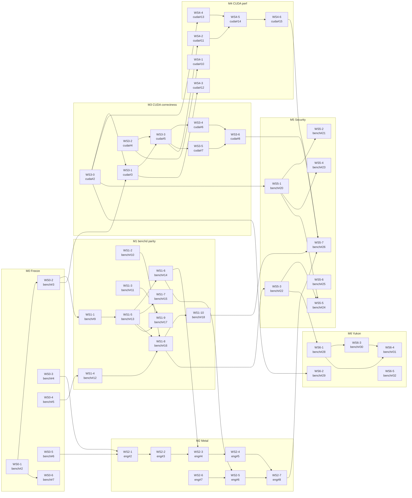

# Implementation dependency graph

Auto-generated from the GitHub issue graph. Every edge below is also a **native
GitHub "blocked by" relationship** on the issues themselves (visible in each issue's
sidebar and dependency summary), so the graph here and the tracker stay in sync.

- **48 tasks**, **53 dependency edges**, acyclic: **True**.
- Node label: `WS<id>` and the owning repo + issue number (`bench`/`eng`/`cuda`).
- Arrows point **from a prerequisite to the work it unblocks**.

## Graph

## Critical path (longest prerequisite chain)

`WS0-1 -> WS0-2 -> WS1-1 -> WS1-5 -> WS1-6 -> WS2-3 -> WS2-4 -> WS2-7 -> WS5-7`

## Roots — startable now (no prerequisites)

WS0-1, WS0-3, WS0-4, WS0-5, WS1-2, WS1-3, WS2-6, WS3-0, WS3-2, WS5-6, WS6-5

## Notes for reviewers

- Some tasks are filed in their **epic's** repo but the code lands elsewhere; the
  issue body's **Where:** line records the true code location (e.g. `bench-transform`
  and `bench-*` tasks under the WS2/WS3/WS4 epics live in `mlxfast-bench`).
- Cross-repo blocking edges are applied natively where the API allows; any that the
  API rejects are recorded as a **Blocked by (cross-repo)** line in the issue body.
