# Execution plan

The granular, ticketed build plan for the benchmarker/engine split. The
[architecture](architecture.md) and [DGX Spark plan](dgx-spark-implementation-plan.md)
give the *what* and *why*; this decomposes them into tasks you can turn into GitHub
issues, with dependencies, sizes, and acceptance criteria.

- **Sizes:** S ≤ 1 day · M ~ 2–4 days · L ~ 1–2 weeks.
- **Task IDs:** `WS<workstream>-<n>`. Referenced by dependencies.
- **Repos:** `bench` = mlxfast-bench · `mlx` = mlxfast-engine · `cuda` =
  cudafast-engine · `chal` = mlxfast-challenge-dev (existing).

## Milestones (exit criteria)

| # | Milestone | Exit criterion |
|---|-----------|----------------|
| **M0** | Seam frozen | Protocol versioned + schema'd; worker split client/server; `mlx-swift-lm` fork pinned; `benchmark.sh` still green |
| **M1** | benchd scoring parity | `benchctl` drives the Swift engine on an M5 and its `score.json` fields match `benchmark.sh --local-iterate`/`--local-submit` on identical weights+golden |
| **M2** | Metal engine extracted + native timing | `mlxfast-engine` is a standalone pinned release; `bench-agent` owns native timing; paired run reproduces today's official numbers within noise |
| **M3** | CUDA correctness parity | `cudafast-engine` passes the conformance kit on DGX Spark at the target's tolerances |
| **M4** | CUDA perf engine + baselines | NVFP4 engine beats a Spark-native baseline under clock-lock, still conformance-green; `qwen36-27b.dgx-spark.toml` written |
| **M5** | Security + official pipeline | Red-team probe passes (golden unreadable, no egress, no out-of-scratch writes); `benchctl official` seals + signs a score |
| **M6** | Yukon cutover | Yukon dispatch → benchd run → `score.json` artifact ingested and ranked |

## Dependency / timeline view

```mermaid
gantt
    dateFormat X
    axisFormat %s
    title Workstream sequencing (relative, not calendar)
    section Freeze (M0)
    WS0 seam + fork pin        :ws0, 0, 3
    section Rust benchd (M1)
    WS1 protocol+scoring       :ws1, 2, 6
    section Metal (M2)
    WS2 extract + measure-job  :ws2, 5, 9
    section Spark bring-up
    WS3.0 env (parallel early) :ws30, 0, 3
    section CUDA correctness (M3)
    WS3 reference engine       :ws3, 6, 10
    section CUDA perf (M4)
    WS4 nvfp4 + baselines      :ws4, 10, 14
    section Ship
    WS5 security + official    :ws5, 12, 16
    WS6 yukon cutover          :ws6, 15, 17
```



The two long poles start early regardless of their milestone position:
**WS2-5 (measure-job reconstruction)** needs live-box access and unknown-unknowns
time-boxing; **WS3-0 (Spark bring-up)** is independent and should begin day one.

---

## WS0 · Freeze the seam  → M0  (repo: chal, bench)

| ID | Task | Size | Deps | Acceptance |
|----|------|------|------|------------|
| WS0-1 | Add `protocol_version`, `backend`, `device` to the `hello` message | S | — | Fields emitted by the worker; existing Swift tests still pass |
| WS0-2 | Author `PROTOCOL.md` + JSON Schema in `bench/crates/bench-protocol` | M | WS0-1 | Schema validates captured live NDJSON traffic (WS0-6) |
| WS0-3 | Split `QwenRuntimeWorker.swift` into client (harness) and server (engine) targets | M | — | Both targets build; `benchmark.sh` green |
| WS0-4 | Split `Constants.swift` into engine-shape vs scoring constants | S | — | Engine target references no scoring constants |
| WS0-5 | **Push + pin `mlx-swift-lm` fork**; remove local-path override in `Package.swift` | M | — | Clean checkout builds with a pinned `Package.resolved` rev, no local path — **hard blocker for WS2** |
| WS0-6 | Capture a corpus of live worker request/response NDJSON as conformance fixtures | S | WS0-1 | Transcripts checked into `bench-protocol/tests` |

## WS1 · Rust workspace to scoring parity  → M1  (repo: bench)

| ID | Task | Size | Deps | Acceptance |
|----|------|------|------|------------|
| WS1-1 | `bench-protocol`: port request/response structs + serde | M | WS0-2 | Round-trips the WS0-6 corpus byte-for-byte |
| WS1-2 | `bench-core`: port score formula (`decode^0.75·prefill^0.25`), floors, acceptance bands | M | — | Unit tests match Swift `Score` test vectors |
| WS1-3 | `bench-core`: port golden schema (`GoldenDocument`, cases, gates, benchmark block) | M | — | Parses existing goldens; rejects malformed |
| WS1-4 | `bench-core`: port scoring constants from the split `Constants.swift` | S | WS0-4 | Single source of the values triplicated today |
| WS1-5 | `bench-runner`: NDJSON client, session lifecycle, nonce validation | M | WS1-1 | Drives the live worker through a full correctness run |
| WS1-6 | `bench-runner`: parent-side prefill/decode timing replicating `QwenRuntimeBenchmark` methodology | L | WS1-5 | Timing matches the Swift harness within noise on the same box |
| WS1-7 | `bench-runner`: phase-close barrier + completed-work counter | M | WS1-5 | Mismatched counter fails the run (unit + integration) |
| WS1-8 | `benchctl iterate`/`submit` driving the Swift engine over stdio | M | WS1-5, WS1-2 | Produces a sealed `score.json` |
| WS1-9 | `bench-core` conformance kit: anchor/free-run gate runner + reference-logits fixture | M | WS1-3, WS1-5 | Green against the Swift engine |
| WS1-10 | **Parity harness**: diff `benchctl` vs `benchmark.sh` score fields | M | WS1-8 | **M1 gate** — fields match on identical inputs |

## WS2 · Extract Metal engine + benchd parity  → M2  (repo: mlx, bench)

| ID | Task | Size | Deps | Acceptance |
|----|------|------|------|------------|
| WS2-1 | Create `mlxfast-engine` package: `MLXFastModel/**` + worker server half + portable core | L | WS0-3, WS0-5 | Builds standalone; runs `runtime-worker` |
| WS2-2 | Pinned release build (binary + `mlx.metallib`) + release-hash manifest | M | WS2-1 | benchd verifies the hash at spawn |
| WS2-3 | `bench-agent`: Seatbelt spawn, env sanitize, native timing, `127.0.0.1` bridge, single-use session-bound token | L | WS1-6, WS2-2 | Second connection / nonce mismatch rejected; timing native |
| WS2-4 | benchd consumes bench-agent's sealed timings (M5 topology) | M | WS2-3 | benchd never times through the VM |
| WS2-5 | **Reconstruct `/opt` measure-job** paired+thermal contract into `bench-runner` | L | WS1-6 | Baseline-first/candidate, thermal gate, one gated retry, calibration band — reproduces official numbers (**long pole**) |
| WS2-6 | `bench-telemetry`: macmon provider (temp gate, clock floor, util) | M | — | Samples match `macmon` CLI |
| WS2-7 | M2 acceptance run | S | WS2-4, WS2-5 | **M2 gate** — paired run within noise; conformance green on Metal |

## WS3 · CUDA correctness reference  → M3  (repo: cuda, bench)

| ID | Task | Size | Deps | Acceptance |
|----|------|------|------|------------|
| WS3-0 | **DGX Spark bring-up**: OS/driver/CUDA, podman + CDI, two service users, clock-lock verify | M | — | Smoke test container sees the GPU; `nvidia-smi -lgc` works (**start day one**) |
| WS3-1 | `cudafast-engine/harness`: protocol-loop server in-container; `hello{backend:"cuda",device:"gb10"}` | M | WS0-2, WS3-0 | Passes protocol conformance test |
| WS3-2 | `bench-transform`: bf16 dequant target from the MLX int4 checkpoint | M | — | Emits a loadable bf16 weight set + config |
| WS3-3 | `cudafast-engine/engine`: Qwen3-Next forward reference at the seam (**stack decision D2**) | L | WS3-1, WS3-2 | Produces logits for a known prompt |
| WS3-4 | Cache semantics parity: 48 recurrent + 16 KV, position-offset rules | M | WS3-3 | Teacher-forced steps match golden anchors |
| WS3-5 | Canonical argmax tie-break (lowest id) + `top_k(8)` | S | WS3-3 | Matches the Metal engine's tie-break |
| WS3-6 | M3 acceptance | S | WS3-4, WS3-5 | **M3 gate** — conformance kit green on Spark at target tolerances |

## WS4 · CUDA performance engine + baselines  → M4  (repo: cuda, bench)

| ID | Task | Size | Deps | Acceptance |
|----|------|------|------|------------|
| WS4-1 | `bench-transform`: NVFP4 quant target (Blackwell-native), group scales | L | WS3-2 | Round-trips within conformance tolerance vs bf16 |
| WS4-2 | Fused kernels: GatedDeltaNet recurrence + attention (cutlass/cuDNN) | L | WS3-3 | Faster than the reference, still conformance-green |
| WS4-3 | Allocator-drain analogue: `cudaDeviceSynchronize` + pool trim + verified-zero | M | WS3-1 | Phase-start pool reports zero, fail-closed |
| WS4-4 | `bench-telemetry`: NVML provider — clock-lock, temp gate, util quiescence | M | WS3-0 | Locks clocks; rejects sub-floor/util-busy |
| WS4-5 | Measure bytes-touched/token + reference baseline on Spark; write `qwen36-27b.dgx-spark.toml` | M | WS4-2, WS4-4 | Baseline recorded; MoE bytes/token measured |
| WS4-6 | M4 acceptance | S | WS4-5 | **M4 gate** — stable timed runs under clock-lock; conformance-green |

## WS5 · Security + official pipeline  → M5  (repo: bench, cuda)

| ID | Task | Size | Deps | Acceptance |
|----|------|------|------|------------|
| WS5-1 | Rootless podman + CDI GPU under the two-user model; validate userns remap (rootful fallback) | L | WS3-0 | Engine runs `--network none`, read-only, cap-drop ALL, with GPU |
| WS5-2 | Throwaway no-network build container for submissions | M | WS5-1 | Builds the editable surface offline; hands only the artifact forward |
| WS5-3 | `benchctl official`: sealing, `.sha256`, integrity record, signing | M | WS1-8 | Sealed score + sidecars; benchd is sole writer |
| WS5-4 | janitor + quarantine units (per-run wipe, drift flag) | M | WS5-1 | Post-run cleanup; quarantine blocks next run |
| WS5-5 | Red-team probe suite | M | WS5-1, WS5-3 | **M5 gate** — golden unreadable, no egress, no out-of-scratch writes |
| WS5-6 | Static-review gate for the `cudafast-engine` editable surface | M | — | CI review runs on submission diffs |
| WS5-7 | Retire `benchmark.sh` + jq scoring copies | S | M1–M4 | Removed; nothing references them |

## WS6 · Yukon integration  → M6  (repo: chal, yukon)

| ID | Task | Size | Deps | Acceptance |
|----|------|------|------|------------|
| WS6-1 | New workflow YAML: dispatch → overlay `editablePaths` → `benchctl official` → upload `score.json` artifact | M | WS5-3 | Runs on the self-hosted runner, uploads the artifact |
| WS6-2 | Register a self-hosted `dgx-spark` GitHub Actions runner | S | WS3-0 | `runs-on: [self-hosted, dgx-spark]` picks up jobs |
| WS6-3 | Update `benchmark.json`: `runner.workflow` + commands to `benchctl` | S | WS6-1 | Manifest validates in Yukon |
| WS6-4 | End-to-end: Yukon dispatch → score ingested + ranked | M | WS6-1, WS6-3 | **M6 gate** — leaderboard reflects a real run |
| WS6-5 | *(optional, deferred)* Option B native `dgx-spark` Yukon provider | L | — | Only if GHA dispatch becomes a bottleneck |

---

## Critical path

```
WS0-5 (fork pin) → WS2-1 → WS2-2 → WS2-3 → WS2-7 (M2)
WS2-5 (measure-job) runs in parallel but gates M2 — start its spike in sprint 1
WS3-0 → WS3-3 → WS3-6 (M3) → WS4-2 → WS4-6 (M4) → WS5 → WS6 (M6)
```

## Parallelization

- **WS1 (Rust benchd)** proceeds in parallel with the WS0 fork/split work — it only
  needs the schema (WS0-2) and a live worker to talk to.
- **WS3-0 (Spark bring-up)** is fully independent — start immediately, before any
  CUDA code exists.
- **WS2-5 (measure-job reconstruction)** needs live-box access; begin the
  investigation spike in sprint 1 even though it lands in M2.

## Sprint 1 (first two weeks) backlog

WS0-5, WS0-1, WS0-2, WS0-3, WS0-4, WS0-6 · WS3-0 · WS1-2, WS1-3 · **spike:** WS2-5
investigation (read the live `/opt` scripts, document the real contract).

## Decisions needed (owner: David)

| # | Decision | Recommendation | Blocks |
|---|----------|----------------|--------|
| D1 | Yukon integration: Option A (GHA + self-hosted runner) vs Option B (native provider) | **A** — zero Yukon code, keeps promotion path | WS6 |
| D2 | CUDA correctness-reference stack: PyTorch/HF vs candle/cudarc | **PyTorch** for parity speed; native for the *performance* engine so no interpreter sits in a scored path | WS3-3 |
| D3 | Baseline policy: per-platform baselines, cross-platform not comparable | **Adopt** — scores carry `backend`/`device` | WS4-5 |
| D4 | Owner + live-box access for measure-job reconstruction | assign in sprint 1 | WS2-5 |

## Open risks (from the design docs, tracked here)

- **measure-job contract is not in any repo** — the paired/thermal/retry logic lives
  in `/opt` operator scripts; WS2-5 is the mitigation, time-boxed in sprint 1.
- **MoE bytes-touched/token unknown on Spark** — probe during WS3-0, measure
  properly in WS4-5; it bounds every plausible speedup.
- **Rootless GPU + userns remap** — validate in WS3-0/WS5-1; rootful fallback keeps
  the two-user separation.
- **NVFP4 parity** — WS4-1 must clear conformance tolerances; the bf16 reference
  (WS3-2) stays as the parity anchor.
