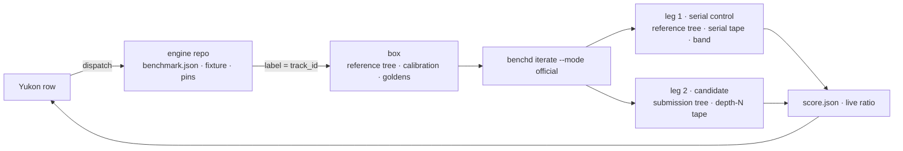
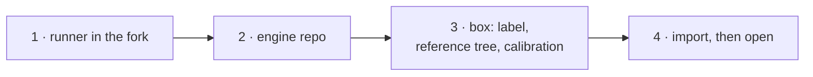

# Runbook: a new engine track, from runner to open row

**Class:** runbook. The box runbooks cover the machine: [`box-setup-runbook.md`](box-setup-runbook.md),
[`runbook-box-setup-mlx.md`](runbook-box-setup-mlx.md), [`runbook-box-setup-cuda.md`](runbook-box-setup-cuda.md).
This page covers the track. Do it once per track. A ranked run is paired, and the baseline is per box
(David ruling 2026-09-08).

## 1. A track is four things

| thing | where | what it holds |
|---|---|---|
| a runner | fork `Libraries/MLXRunners/<Family>Runner.swift` plus one line in `RunnerRegistry.swift` | the model behind CBv2, and a static manifest: decoders, depth range, regimes |
| an engine repo | `{mlxfast\|cudafast}-{model}{ver}-{params}-engine` | `benchmark.json`, the track fixture, the fork pin, the benchd channel, `benchmark.yml` |
| goldens | `correctness_prompts/<track_id>/` in the engine repo | the timed pool, the live golden, one oracle for each permitted draft depth |
| per-box state | the runner service environment on the box | the track label, the built reference tree, this box's calibration file |

The fixture names the rest: `live_golden` is the one scored prompt, `live_golden_speculative` holds
one tape for each depth, `baseline_reference_commit` is the commit the reference tree must sit at,
`official_pairs` is the number of pairs one ranked run measures (2 on both platforms, David ruling
2026-09-09), `decode_speedup_floor` and `prefill_speedup_floor` are the two speedup floors the
scored run must clear (0.95 and 0.95, same ruling), and every golden is pinned there by sha256 and
bytes. No golden holds a baseline pair, and no
fixture or constant holds one either. benchd refuses a golden that carries
`benchmark.baseline_*_seconds_per_token` on the ranked path.

Two names carry the per-box state. `MLXFAST_BASELINE_WORKSPACE` is the built reference tree;
`MLXFAST_BASELINE_CALIBRATION` is this box's `baseline-calibration.json`. `tools/calibrate-box.sh`
writes that file. It runs `benchd calibrate-baseline` for 4 passes on the reference tree, and it
refuses to write when the coefficient of variation is above 1 % on either axis. The file is a health
band for the serial-control leg, never a denominator: a stale file cannot move a score, only stop a
run. benchd itself is built and published from bench `main` to the dist channel. The engine names
the channel only; `tools/fetch-benchd.sh` resolves it and verifies the binary against
`benchd.manifest.json`. A ranked box holds that pair offline in `BENCHD_BIN_DIR`.

Each ranked job measures `official_pairs` pairs on the same box, in the same job, over the live
golden. Every pair is the same two legs in the same order. Leg 1 is the **serial-control leg**, on
the reference tree, with no speculation: benchd verifies its tokens against the serial tape
(`--control-golden`), checks its cost against this box's band, and stops the run when the leg falls
outside. Leg 2 is the **candidate leg**, on the submission tree at its declared draft depth,
verified against that depth's tape. Each leg boots its own engine and loads the model once. benchd
sums each role's per-token times over the pairs, and the score is the live ratio of the sums:
`(ref_prefill / cand_prefill)^0.25 * (ref_decode / cand_decode)^0.75`.

Two gates then apply to that ratio. The decode speedup must be at or above
`decode_speedup_floor`, and the prefill speedup must be at or above
`prefill_speedup_floor`. Each axis has its own floor, and each floor fails the run on its own.
benchd seals the two floors it used in `metrics.decode_speedup_floor` and
`metrics.prefill_speedup_floor`, so the artifact states the gate it passed.

The fixture is the only source of these three values. A fixture without `official_pairs`, without
`decode_speedup_floor` or without `prefill_speedup_floor` refuses the ranked run. There is no flag,
no environment variable and no default: benchd never guesses a pair count or a floor. A local run
with no `--contract` uses 1 pair and the 0.95 / 0.95 defaults, and says so in its log.



## 2. The four steps



1. **Runner.** Add the runner file, register the `model_type`, prove the wire, merge to fork `main`:

   ```bash
   swift build -c release --product bench-worker
   .build/release/bench-worker manifest --runner <runnerID> --digest
   benchd correctness --manifest <manifest JSON> --engine .build/release/bench-worker --weights <dir>
   ```

2. **Engine repo.** Seed it from the newest engine repo's `main` as one signed commit, then stamp
   the new identity:

   ```bash
   tools/new-track.sh --track-id <track_id> --fork-sha <40 hex> \
                      --checkpoint <hf_repo>@<40 hex> --os macOS
   ```

   The script stamps the names, the fork pin, the benchd channel and the `runs-on` label, and pins
   the checkpoint files. It commits nothing. Review the diff, commit, push.

3. **Box.** Register the runner with the label `self-hosted, <os>, <track_id>`. Record the goldens
   on the box, commit them with their pins, and stage them. Then build the reference tree and
   calibrate:

   ```bash
   tools/stage-baseline-workspace.sh <reference dir>
   export MLXFAST_BASELINE_WORKSPACE=<reference dir>
   tools/calibrate-box.sh "<runner name>" <calibration file>
   export MLXFAST_BASELINE_CALIBRATION=<calibration file>
   tools/ranked-box-preflight.sh
   ```

   Export both names in the runner service environment. The preflight refuses when the tree is not
   at `baseline_reference_commit`, or when the calibration names another track or another box.

4. **Import.** One command imports the branch, waits for the validation run, and opens the row.
   The seed's `mtp-head.manifest.json` declares `spec.enabled: false`, so the validation run
   measures two serial legs and scores near 1.00.

   ```bash
   bun run work/mlx-reimport/import-branch.ts git@github.com:Layr-Labs/<engine>.git \
     --branch main --api https://api-dev.yukon.org --open
   ```

Submissions build on the branch tip, so a trusted-file fix needs no reimport. Never archive an open
row. A depth-N declaration is one edited file: `mtp-head.manifest.json`.

## 3. What still takes hand work

| item | state |
|---|---|
| the reference tree and the calibration file | staged per box by hand. `tools/stage-baseline-workspace.sh` builds the tree, `tools/calibrate-box.sh` writes the band. The ranked job holds no credential, so it only verifies them. |
| model facts for a new family | `tools/new-track.sh` copies the template's layer counts, head widths and expert geometry. Re-author the fixture's `target` block. |
| hosted CI on the MLX engine repos | red. `ci.yml` checks out with `submodules: false`, so `Vendor/mlx-swift-lm` stays empty and each Swift step fails. |

## 4. Checklist

- [ ] runner merged to fork `main`; `bench-worker manifest --digest` matches the hello
- [ ] engine repo pushed; `tools/fetch-benchd.sh` resolves benchd from the channel
- [ ] runner online with the label; timed pool and per-depth tapes staged and pinned
- [ ] reference tree built at `baseline_reference_commit`, calibration written with CV at or under 1 %, both names exported, `tools/ranked-box-preflight.sh` passing
- [ ] validation run scores near 1.00; the row is open; one depth-N submission accepted
